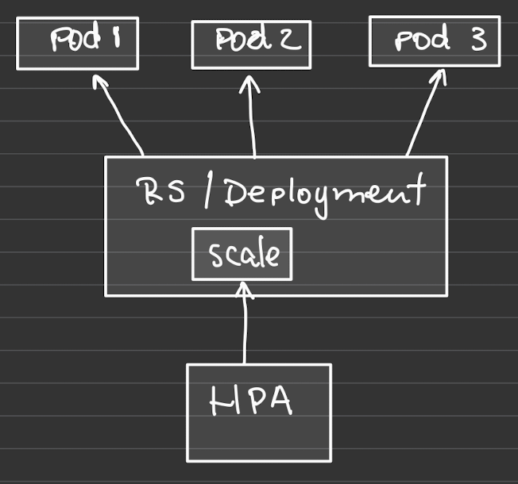
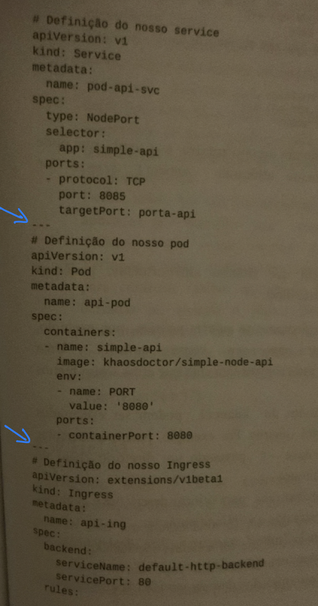

# Um estudo de Kubernetes

Este documento é uma compilação do estudo feito sobre o funcionamento do K8S e pode apresentar conceitos incompletos, inconsistentes, ou mesmo incorretos. O propósito é de apenas responder algumas perguntas básicas sobre a anatomia do K8S.

> ### O que é o Kubernetes?
>
> Kubernetes ou K8S, é um sistema open source para automação, gerencia, escalabilidade e deploy de aplicações baseadas em containeres.
>
> K8S foi criado por 3 engenheiros do Google e é sucessor de projetos mais antigos, Borg e Omega.
>
> Nas minhas palavras:
> K8S é um sistema de gerenciamento, escalabilidade e deploy de sistemas distribuidos baseados em containeres.

> ### Porque usar K8S? Quais as vantagens?
>
> Numa estratégia bem executada de K8S, ganhamos uma infraestrutura como código, versionada, facilmente repetível, recuperável e escalável, sem a preocupação com máquinas e suas configurações. Alem disso:
>
> - K8S pode ser um divisor de águas, entre ter uma infraestrutura mal administrada e uma estrutura completamente versionável e escalável.
> - Com o K8S não temos mais problemas com máquinas, disponibilidade, e tudo se tornou extremamente fácil de manusear e recriar, pois tudo está versionado e pode ser utilizado por qualquer pessoa.

> ### Qual a diferença entre VM e K8S?
>
> Na técnica de virtualização que conhecemos como VMs ou Máquinas Virtuais, temos uma máquina (host) capaz de executar novas instancias de um sistema operacional completo, ou seja, podemos executar diversos pequenos computadores dentro de um grande computador de forma isolada (sem que os recursos de um sejam compartilhados pelo outro).  
> K8S utiliza o sistema de containers, que é uma especie de virtualização mais leve pois as novas instancias de SO compartilham o Kernel do host que fica responsável pelo gerenciamento de memória, I/O, CPU, e etc. As imagens de SO utilizadas nos containers geralmente são bem reduzidas pois trazem apenas o mínimo para o funcionamento do sistema, já que o host é responsável por parte do trabalho.

## A anatomia de cluster K8S

> ### Quais são os principais objetos do K8S?
>
> K8S possui um conjunto de objetos com funções distintas, alguns dos mais comuns são: 
> Pod, Service, Deployment, Ingress, Cronjob, Volume, Secret, ConfigMap, ReplicaSet e Horizontal Pod Autoscale (HPA)

> ### O que é um Pod?
>
> Pods são a menor estrutura possível, ou a menor estrutura publicavel do K8S. Ele é a abstração para um processo rodando no cluster, podemos entende-lo como um agrupador de containeres, embora a recomendação é que cada Pod tenha apenas um container.  
> Um Pod é efemero, isto é, ele é considerado uma unidade totalmente descartavel do K8S. Todo o trabalho feito pelo pod ou no pod só se mantem nele até que seja removido, então tudo é perdido.

> ### O que é Service?
>
> Assim como o Pod, Service é uma abstração, porem de rede. Definem um conjunto lógico de pods e uma politica pela qual saberemos como vamos acessa-los.
> 
> Como pods são efemeros, os IPs fatalmente irão mudar, então acessamos nossas aplicações atraves dos Services que possuem IP fixo.  
> Services implementam Label Selectors que é o artificio usado para agrupar os pods.
> Existem algumas práticas recomendadas para definição dessas Labels:
>
> - Definir ambiente: env=prod
> - Versionamento: version=1.2.1
> - Nome do serviço: app_name=api-livros
> - Agrupamento de projetos: project=api-containers
>   
>   Existem 4 tipos de Services: ClusterIP, NodePort, LoadBalancer e ExternalName. Detalhes sobre eles podem ser vistos nas referências.

> ### O que é Deployment?
>
> Deployment é um objeto K8S que contem a definição de um Pod. K8S procura fazer com que o(s) Pod(s) estejam exatamente como definido no Deployment. Por exemplo, se definirmos que queremos 3 Pods rodando, então ao criar esse Deployment, 3 Pods serão criados e se em qualquer momento um desses Pods sofrer um crash e cair, um novo Pod com as mesmas caracteristicas será criado para manter o estado desejado de 3 Pods.
> É uma boa prática nunca criar Pods diretamente, mas sim sempre Deployments que contem ReplicaSets e estes contem os Pods.
> Os Deployments gerenciam as ReplicaSets e estas gerenciam os Pods.
> Uma das vantagens dessa estrutura é que ganhamos um histórico de versões que foram executadas e isso nos permite que façamos rollback de versões em produção sem downtime.
> 
> Pods, ReplicaSets e Services são usados para construir uma unica instancia da nossa aplicação. Contudo, eles ajudam pouco a sustentar a rotina diaria de nova releases.
>
> O objeto Deployment existe para gerenciar a release de novas versões. Eles possibilitam facilmente mudar de uma versão de nosso código para outra. O processo de rollout é cuidadoso pois considera o tempo que definimos entre atualizar cada Pod. Ele tambem usa Healthchecks para garantir que a nova versão da aplicação está operando corretamente e interrompe o deployment se muitas falhas ocorrerem.
>
> Deployments são objetos declarativos que descrevem uma aplicação deployada. As duas operações mais comuns num Deployment são Scaling e Application Updates.
> Deployments mantem historico dos rollouts. O que nos permite entender o estado anterior de deployment e fazer rollback para uma versão especifica.
>
> #### Deployment strategies
>
> Quando queremos atualizar a versão do nosso software, o Deployment oferece duas estratégias:
>
> - Recreate  
>   Recreate é simples e rápido. O Deployment atualiza o ReplicaSet para usar a nova imagem e então derruba todos os Pods e depois os recria com a nova imagem. O problema é que essa estratégia causa downtime a aplicação, perdendo requests.
> - Rolling Update  
>   Rolling Update é mais lento que o Recreate mas mais seguro e robusto. A vantagem dessa estratégia é que ela não causa downtime, uma vez que apenas alguns Pods são atualizados, enquanto os demais continuam recebendo requisições. De forma incremental, os demais Pods vão sendo atualizados até que todos estejam com a nova versão.

> ### O que é ReplicaSet?
>
> Pods são essencialmente singletons e existem diversos motivos que nos fazem querer ter replicas de um container, como: redundancia, escala, sharding (diferentes replicas podem lidar com diferentes partes de uma computação em paralelo).
> Um ReplicaSet age como um gerenciador de Pods, garantindo que os tipos certos e a quantidade de Pods estejam em execução.
> Pods gerenciados por ReplicaSets são automaticamente reagendados após certas condições de falhas no nó e rede.
> O Reconciliation Loop roda constantemente, observando o estado atual e agindo para tentar fazer com que o estado atual coinscida com o estado desejado.
> ReplicaSets e Pods não são acoplados, pois embora os RS criem e gerenciam Pods, eles não são donos dos Pods.
> Já o HPA, entra quando queremos definir uma forma de escalar automaticamente os Pods.

> ### O que é Horizontal Pod Autoscale (HPA)?
>
> É um worload cuja a função é escalar horizontalmente Pods dentro de ReplicaSets, baseado em consumo de CPU e memória.  
> O HPA funciona como um loop de controle com um tempo de sincronização default de 30 segundos. Isso significa que a cada 30 segundos o controlador vai buscar as métricas disponíveis no pod e tomar uma decisão baseado nos resultados dessas métricas e no valor que foi definido como limitante para que seja escalado.
> 

> ### O que é Namespace?
>
> É um artificio que possibilita os workloads em nosso cluster. Seu uso é extramamente recomendado, pois eventualmente em ambiente produtivo teremos um sem-fim de workloads o que dificultará o gerenciamento. Quando usamos namespaces agrupamos workloads e estes ficam isolados de outros.  
> Podemos definir namespaces para separar camadas de nossos projetos, como por exemplo, um namespace para o frontend e outro para o backend.
>
> Algumas caracteristicas importantes:
>
> - Nomes de recursos são unicos por Namespace, ou seja, não podemos ter dois Deployments com o mesmo nome no mesmo Namespace, mas podemos ter nomes de recursos iguais em Namespaces diferentes.
> - Podemos utiliza-los para dividir recursos do cluster entre usuarios que o estão utilizando. É possivel definir limites de recursos para cada usuário em seu próprio Namespace (como se fosse um escopo de acesso).
>
> Namespaces padrões:  
> Ao criar um cluster, 3 Namespaces são automaticamente criados.
>
> - default - É o Namespace padrão, onde os nossos workloads são criados quando não especificamos um.
> - kube-system - Onde ficam os objetos do sistema do cluster. Deve permanecer inalterado, pois qualquer alteração pode interferir no funcionamento do cluster como um todo.
> - kube-public - Um local que pode ser acessado por todos os usuários do cluster. Normalmente é utilizado para armazenar objetos do sistema do K8S que podem ser observados por qualquer pessoa, mas tambem é utilizado por muitas ferramentas para expor serviços que devem ser acessiveis publicamente.
>
> É uma boa prática criar Namespaces para separar ambientes (como Dev, QA e Prod).  
> A organização que os Namespaces promovem tambem nos ajuda quando queremos por exemplo substituir uma aplicação por outra, pois podemos remover o Namespace todo, assim, todos os objetos tambem associados tambem são removidos.  
> Namespaces tambem favorecem o acesso entre serviços, pois um serviço que está em um Namespace pode acessar outro serviço de outro Namespace através da rede interna (sem ir a internet). Para fazer isso, usamos: <nome-servico>.<nome-namespace>.svc.cluster.local.

> ### O que é Ingress?
>
> Ingress é um objeto K8S que possibilita que possam ser feitas requisições da internet as aplicações do cluster com regras especificas dizendo quem pode acessar o que atraves de um nome (DNS).  
> Logo ele liga rede externa (internet) a rede interna do K8S como um Edge Router.
> 
> É possível ter apenas um Ingress para todo o cluster, mas é boa pratica manter nossas APIs com seus proprios recursos.  
> Outra boa pratica é configurar o cluster de tal forma que toda as requisicoes sejam feitas atraves de Ingress e que os Services estejam fechados, sendo do tipo ClusterIP.

> ### O que são Volumes?
>
> É uma abstração do K8S que resolve dois problemas:
>
> 1. Persistencia de dados
> 2. Compartilhamento e dados entre containers dentro do mesmo pod.
>
> Já que containers e pods e são efemeros, ou seja, podem ser destruidos e recriados a qualquer momento, quando isso ocorre, qualquer dado salvo nestes containers será perdido.  
> Entretanto existe um terceiro problema. Se a infraestrutura onde o volume foi criado deixar de existir, o volume tambem deixará de existir.
>
> #### Tipos de Volume mais usados
>
> - **Volumes Cloud** - Podemos usar um serviço cloud como volume direto no nosso cluster (AWS Elastic Block Store, Azure Disk, Azure File, Google Cloud Persistent Disk).
> - **ConfigMap e Secret** - São capazes de armazenar uma informação criada pelo usuario. Essa informação pode ser acessada diretamente atraves da API do K8S ou então montada como um arquivo dentro do container.
>
>   Secrets são usados para guardar dados sensíveis usados pelas aplicações de forma segura. Normalmente guardamos senhas de bancos de dados, chaves privadas de certificados, client secrets para autenticação via JWT e outros. Uma das vantagens do Secrets, é que ele pode ser incluido na especificação de um pod, permitindo um melhor controle sobre como ele é usado e reduzindo o risco de exposição acidental desses dados.  
>   Um Secret pode ser usado de duas formas: Através de um volume que é montado após o download da imagem, ou pelo kubelet no momento em que está baixando a imagem do pod, através de variaveis de ambiente.
>
>   Usamos ConfigMaps para aqueles dados que não são sensiveis, em geral, parametros de configuração da aplicação, como nome de servidor e caminho para arquivos de log por exemplo, assim essas informações ficam separadas.  
>   Podemos montar o ConfigMap como volume e configurar a aplicação para ler desse arquivo, assim conseguimos atualizar esses parametros sem ter que reiniciar a aplicação. Se essas configurações fossem lidas de variaveis de ambiente, o pod precisaria ser reiniciado pois essas variaveis são carregadas quando o pod é criado.

> - **Volumes persistentes** - Trata-se de como o armazenamento será provisionado. Ele é um diretorio de armazenamento provisionado no cluster. É um serviço como qualquer outro (pod, service, etc). A diferença entre Volumes e Volumes Persistentes é que os PVs tem um lifecycle completamente independente do pod que o está utilizando. Com isso, podemos utilizar este tipo de serviço para criar um banco de dados ou armazenar um conteudo que deve ser realmente persistente, pois ele não será destruido ao fim da execução. Este tipo de volume é frequentemente associado a armzenamento em nuvem como Azure Blob Storage, AWS S3 e outros.

> #### O que é um Cronjob?
>
> É uma maneira de executar um job de acordo com um agendamento.
> K8S tem dois tipos de jobs. Run to Completion, que executa até que a tarefa seja completada, e o Cronjob que executa uma aplicação de acordo com um intervalo de tempo definido.  
> Um job no K8S é um workload que cria um ou mais pods e garante que a aplicação seja executada. Uma vez que o trabalho neste pod é concluido, ele é finalizado, mas não é terminado, ou seja, o pod não executa mais nada, mas ainda é um pod ativo mas que entrou no estado Completed, o que indica que foi executdo e concluido com sucesso.  
> Uma grande vantagem desse workload é que garantimos a execução com sucesso, uma vez que se o pod sofrer algum tipo de problema, o job criará mais um pod para substitui-lo.  
> Em resumo, Cronjobs são essencialmente um job que pode ser agendado para executar em uma data ou intervalo especifico, usando a sintaxe crontab.

> ### Como funcionam os Healthchecks?
>
> Quando executamos nossa aplicação no K8S, ela é automaticamente mantida viva usando um Healthcheck do processo. Esse Healthcheck não é suficiente para garantir que a aplicação está saudável pois é possível que o processo esteja executando mas a aplicação esteja em deadlock por exemplo.
> Para resolver essa questão o K8S oferece o Liveness Healthcheck, que permite configurar um Healthcheck fornecido pela aplicação, na configuração do Pod.  
> Liveness Probes são definidos por container, o que significa que cada container dentro de um Pod tem sua saude checada separadamente.  
> Existe tambem o Readiness Probe. Enquanto o Liveness check determina se uma app está saudável e quando não está, o container é reiniciado, o Readiness indica quando um container está pronto para receber requests, e containers que falham o Readiness check são removidos do Load Balancer.

> ### O que é Helm e como funciona?
>
> Helm é um gerenciador de pacotes que, ao mesmo tempo procura aplicações e realiza a instalação automatica de itens como o Ingress Controller, sistemas de monitoramento, bancos de dados, e muitas outras aplicações. Com ele deixamos de criar workloads manualmente.  
> O Helm consiste em uma ferramenta de linha de comando que possui diversos comandos de instalação de pacotes composto por duas partes:
>
> - Helm Client - CLI que roda na máquina local e é a interface entre o usuário e o Helm.
> - Tiller - Um workload que é criado no cluster local após a execução do comando `helm init`.
>
> O Helm utiliza os Charts, que são pacotes que podem ser instalados no cluster K8S. Por exemplo, o chart nginx-ingress-controller instalará tudo o que é necessário para que nosso controle de ingress precisa para funcionar, tornando fácil qualquer tipo de instalação com o `helm install` ou a remoção com `helm delete`.

## Práticas

### Controle de versão

É uma excelente pratica sempre armazenar os arquivos manifesto em um sistema de versionamento como o Git. Isso evita que alterações sejam perdidas entre as mudanças de infraestrutura, uma vez que cada arquivo representa uma aplicação ou então um serviço de rede.
A partir do controle de versão tambem podemos disparar atualizações na infraestrutura atraves de CD pipeline.

### Agrupamento de objetos do mesmo tipo

É possível agrupar workloads relativos ao mesmo serviço em um unico arquivo quando utilizamos yaml como manifesto.  
Um exemplo é quando temos um Pod que possui um Service e um Ingress, é preferível que os tres workloads fiquem definidos no mesmo arquivo do que separados. Isso pode ser feito adicionando "---" entre as definições.

### Outras dicas

- Evitar usar o namespace default
- Muitos comandos do Kubectl podem ser executados sobre diretórios inteiros, como por exemplo:  
  `kubectl create -f`  
  Passando um diretório cheio de arquivos manifestos.
- Utilizar Annotations para colocar descrições e qualquer informação extra que o workload possa ter.
- Evitar usa Pods "soltos", sempre utilizar Deployments ou ReplicaSets como agregador.
- Criar os Services antes dos demais workloads que ele possa utilizar, isso porque todos os Pods que são criados recebem por padrão uma variável de ambiente que diz o host e a porta de todos os serviços que já estão em execução no cluster.
- Tentar não especificar um hostport para um Pod, a não ser que seja absolutamente necessário. Quando criamos um hostport para um Pod, estamos criando um vinculo deste Pod com uma porta especifica, o que diminui a quantidade de locais possiveis para este Pod ser criado, uma vez que a combinação de IP, porta e protocolo deve ser unica em cada nó.
- Definir labels que são identificadores semanticos da sua aplicação, por exemplo:

        app: nome-do-app,
        tipo: frontend,
        env: stage,
        versao: 3.0.0

## Mãos a obra com arquivos de manifesto
Os comandos devem ser executados na pasta "manifests".

## Preparando o ambiente 
- Iniciar o Docker.

- Iniciar o Minikube.   
`minikube start`

- Listando os contextos. O Minikube automaticamente cria um.  
`kubectl config get-contexts`

## Criando o primeiro Pod com uma simples app
- Criando o Pod  
`kubectl create -f example-1.json`

- Para ver a saida da aplicacao.  
`kubectl logs api-pod`

## Expondo o Pod criado anteriormente com Services
Aqui temos a adição de uma label no Pod que o associa ao Service.

- Verificar se o Pod está executando  
`kubectl get pods`

- Se o Pod estiver executando, atualize ele ou delete 
`kubectl delete pod api-pod`
`kubectl apply -f example-2.json` 

- Caso o Pod não esteja executando, crie-o com:  
`kubectl create -f example-2.json`

- Criando o Service  
`kubectl create -f example-3.json`

- Veja a descrição completa do Pod  
`kubectl describe pod api-pod`

- Para acessar a aplicação  
Esse comando mostrará o ip e porta onde a aplicação pode ser acessada. Basta colar no navegador.  
`minikube service pod-api-svc`