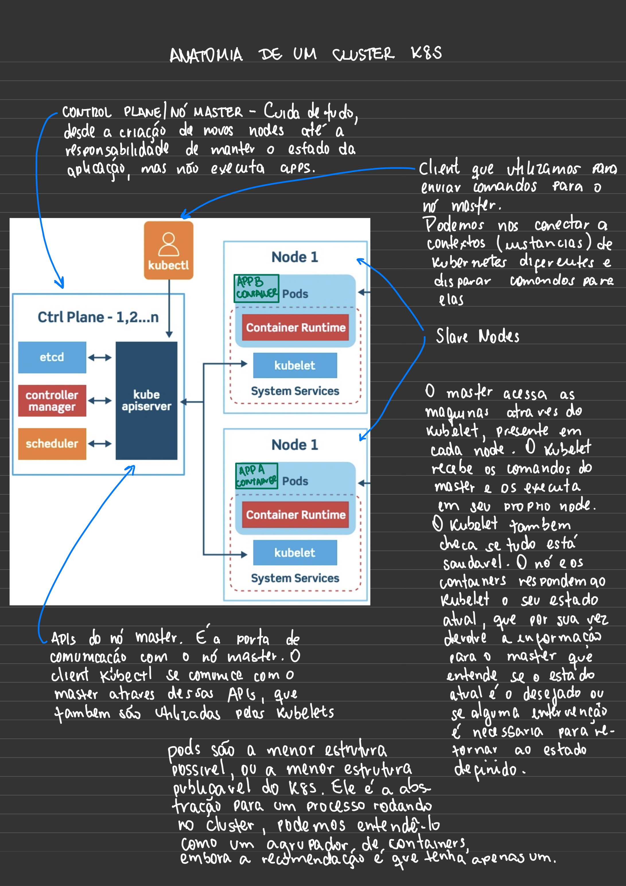
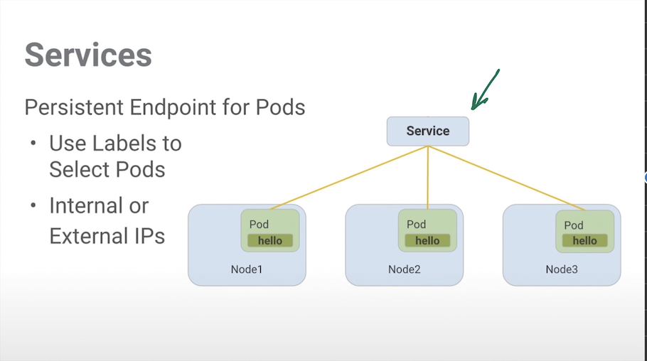
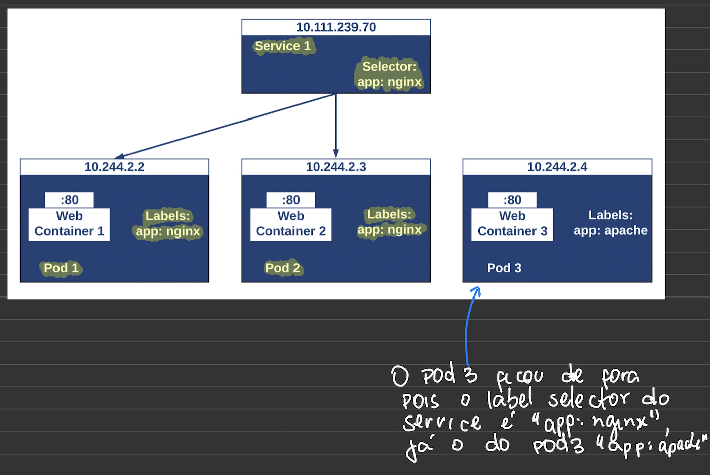
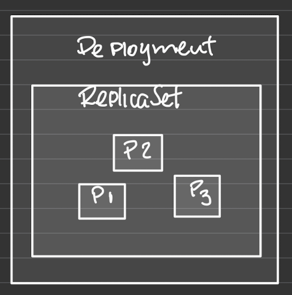
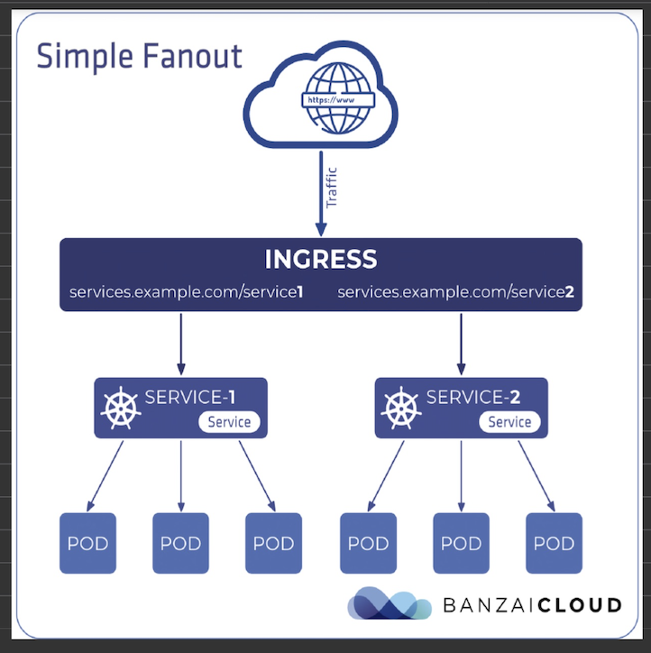

# Um estudo de Kubernetes

Este documento é uma compilação do estudo feito sobre o funcionamento do K8S e pode apresentar conceitos incompletos, inconsistentes, ou incorretos.

> ### O que é o Kubernetes?
>
> Kubernetes ou K8S, é um sistema open source para automação, gerencia, escalabilidade e deploy de aplicações baseadas em containeres.

Nas minhas palavras:
K8S é um sistema de gerenciamento, escalabilidade e deploy de sistemas distribuidos baseados em containeres.

K8S foi criado por 3 engenheiros do Google e é sucessor de projetos mais antigos, Borg e Omega.

> ### Qual a diferença entre VM e K8S?
>
> ifjsdif

## A anatomia de cluster K8S

> ### Quais são os principais objetos do K8S?
>
> K8S possui um conjunto de objetos com funções

> ### O que é um Pod?
>
> Pods são a menor estrutura possível, ou a menor estrutura publicavel do K8S. Ele é a abstração para um processo rodando no cluster, podemos entende-lo como um agrupador de containeres, embora a recomendação é que cada Pod tenha apenas um container.  
> Um Pod é efemero, isto é, ele é considerado uma unidade totalmente descartavel do K8S. Todo o trabalho feito pelo pod ou no pod só se mantem nele até que seja removido, então tudo é perdido.

> ### O que é Service?
>
> Assim como o Pod, Service é uma abstração, porem de rede. Definem um conjunto lógico de pods e uma politica pela qual saberemos como vamos acessa-los.
> 
> Como pods são efemeros, os IPs fatalmente irão mudar, então acessamos nossas aplicações atraves dos Services que possuem IP fixo.  
> Services implementam Label Selectors que é o artificio usado para agrupar os pods.
> Existem algumas práticas recomendadas para definição dessas Labels:
>
> - Definir ambiente: env=prod
> - Versionamento: version=1.2.1
> - Nome do serviço: app_name=api-livros
> - Agrupamento de projetos: project=api-containers
>   
>   Existem 4 tipos de Services: ClusterIP, NodePort, LoadBalancer e ExternalName. Detalhes sobre eles podem ser vistos nas referências.

> ### O que é Deployment?
>
> Deployment é um objeto K8S que contem a definição de um Pod. K8S procura fazer com que o(s) Pod(s) estejam exatamente como definido no Deployment. Por exemplo, se definirmos que queremos 3 Pods rodando, então ao criar esse Deployment, 3 Pods serão criados e se em qualquer momento um desses Pods sofrer um crash e cair, um novo Pod com as mesmas caracteristicas será criado para manter o estado desejado de 3 Pods.
> É uma boa prática nunca criar Pods diretamente, mas sempre sim Deployments que contem ReplicaSets e estes contem os Pods.
> Os Deployments gerenciam as ReplicaSets e estas gerenciam os Pods.
> Uma das vantagens dessa estrutura é que ganhamos um histórico de versões que foram executadas e isso nos permite que façamos rollback de versões em produção sem downtime.
> 

> ### O que é ReplicaSet?

> ### O que é HPA?

> ### O que é Namespace?

> ### O que é Ingress?
>
> Ingress é um objeto K8S que possibilita que possam ser feitas requisições da internet as aplicações do cluster com regras especificas dizendo quem pode acessar o que atraves de um nome (DNS).  
> Logo ele liga rede externa (internet) a rede interna do K8S como um Edge Router.
> 
> É possível ter apenas um Ingress para todo o cluster, mas é boa pratica manter nossas APIs com seus proprios recursos.  
> Outra boa pratica é configurar o cluster de tal forma que toda as requisicoes sejam feitas atraves de Ingress e que os Services estejam fechados, sendo do tipo ClusterIP.

> ### O que são Volumes?
>
> É uma abstração do K8S que resolve dois problemas:
>
> 1. Persistencia de dados
> 2. Compartilhamento e dados entre containers dentro do mesmo pod.
>
> Já que containers e pods e são efemeros, ou seja, podem ser destruidos e recriados a qualquer momento, quando isso ocorre, qualquer dado salvo nestes containers será perdido.  
> Entretanto existe um terceiro problema. Se a infraestrutura onde o volume foi criado deixar de existir, o volume tambem deixará de existir.
>
> #### Tipos de Volume mais usados
>
> - **Volumes Cloud** - Podemos usar um serviço cloud como volume direto no nosso cluster (AWS Elastic Block Store, Azure Disk, Azure File, Google Cloud Persistent Disk).
> - **ConfigMap e Secret** - São capazes de armazenar uma informação criada pelo usuario. Essa informação pode ser acessada diretamente atraves da API do K8S ou então montada como um arquivo dentro do container.
>
>   Secrets são usados para guardar dados sensíveis usados pelas aplicações de forma segura. Normalmente guardamos senhas de bancos de dados, chaves privadas de certificados, client secrets para autenticação via JWT e outros. Uma das vantagens do Secrets, é que ele pode ser incluido na especificação de um pod, permitindo um melhor controle sobre como ele é usado e reduzindo o risco de exposição acidental desses dados.  
>   Um Secret pode ser usado de duas formas: Através de um volume que é montado após o download da imagem, ou pelo kubelet no momento em que está baixando a imagem do pod, através de variaveis de ambiente.
>
>   Usamos ConfigMaps para aqueles dados que não são sensiveis, em geral, parametros de configuração da aplicação, como nome de servidor e caminho para arquivos de log por exemplo, assim essas informações ficam separadas.  
>   Podemos montar o ConfigMap como volume e configurar a aplicação para ler desse arquivo, assim conseguimos atualizar esses parametros sem ter que reiniciar a aplicação. Se essas configurações fossem lidas de variaveis de ambiente, o pod precisaria ser reiniciado pois essas variaveis são carregadas quando o pod é criado.

> - **Volumes persistentes** - Trata-se de como o armazenamento será provisionado. Ele é um diretorio de armazenamento provisionado no cluster. É um serviço como qualquer outro (pod, service, etc). A diferença entre Volumes e Volumes Persistentes é que os PVs tem um lifecycle completamente independente do pod que o está utilizando. Com isso, podemos utilizar este tipo de serviço para criar um banco de dados ou armazenar um conteudo que deve ser realmente persistente, pois ele não será destruido ao fim da execução. Este tipo de volume é frequentemente associado a armzenamento em nuvem como Azure Blob Storage, AWS S3 e outros.

> ### O que é Helm e pra que serve?
